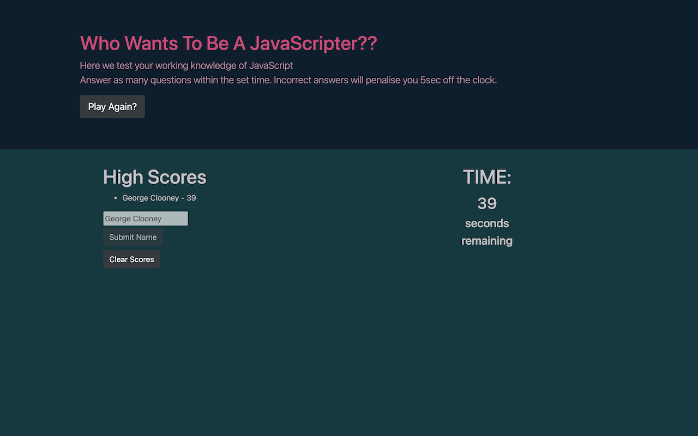

# 04-HW-CodeQuiz

## Description
Our client has requested that we build them a timed coding quiz with multiple-choice questions to help them assess potential employees and their knowledge of JavaScript fundamentals.

## Criteria
- Start button starts the timed game
- Consecutive questions appear on screen when an answer is submitted
- Time deductions for wrong answers
- Game ends when all questions answered or time reaches 0
- Score & initials are saved when game ends
- HTML & CSS are dynamically updated

## Deployment
https://mrsamlaw.github.io/04-HW-CodeQuiz/

## Screenshots

Questions & Choices

George Clooney likes this!!

### Psuedo Code
How I went about building the game

- Initialize game
    - Set questions & answers
    - disable key input
    - fetch local data
    - display high score
    - Set timer to length of time
- Start game on start button press
    - Show question & answer options
    - Register answer
        - If correct -> next question
        - If wrong -> deduct time -> next question
    - If time > 0 and questions remain, loop
    - Else End Game
- Show score
- User input details
    - Store user details & score
- Play again?

#### Aspirational Changes
Some things I'd like to build into a later version of the game
- Allow for key number input
- Correct answers add time
- Live updating of leaderboard

## Inspiration
The color styling was inspired by this image from this image: Protect by artist Andra (https://dribbble.com/stutpak).  
